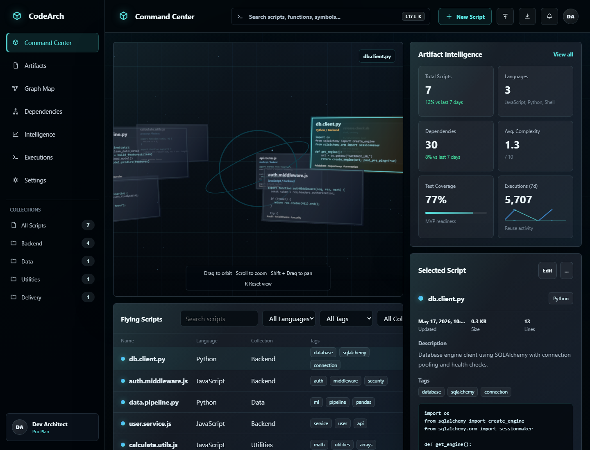
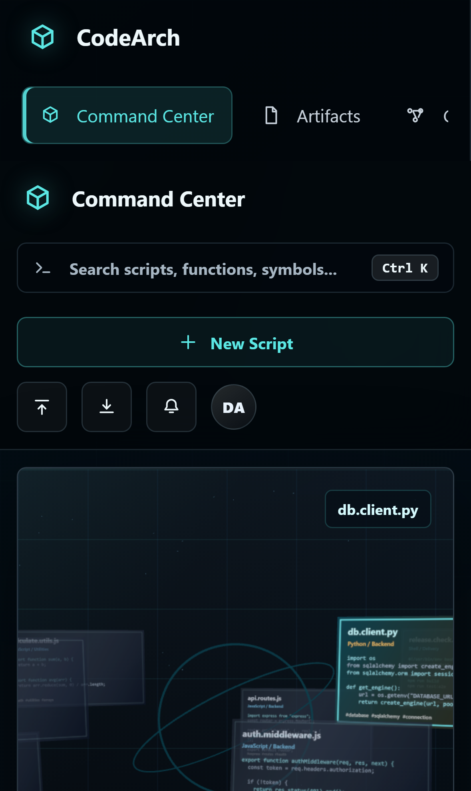

# CodeArch Command Center

CodeArch is a premium local-first code archive for saving, searching, filtering, previewing, editing, importing, exporting, and reusing code snippets. The current MVP is a React/Vite dashboard inspired by a next-generation developer command center: dark UI, glass panels, a 3D flying-scripts scene, an artifact intelligence panel, and a dense script library.

## Stack

- React 19
- Vite
- Plain JavaScript / JSX
- Global CSS design system in `src/styles/codearch.css`
- LocalStorage-backed repository in `src/services/codeArtifactRepository.js`
- Three.js loaded lazily for the spatial script scene
- Playwright e2e tests

## Main Features

- Search saved scripts by title, language, collection, tag, source, summary, and code.
- Filter by language, tag, and collection.
- Sort by updated date, reuse count, title, language, or size.
- Open the command palette with `Ctrl+K` or `Cmd+K`.
- Select a script and inspect description, tags, size, line count, and code.
- Create and edit scripts through the snippet editor.
- Delete scripts with confirmation.
- Copy code to the clipboard.
- Import and export CodeArch JSON archives.
- Responsive dashboard layout for desktop, tablet, and mobile.

## Portfolio Screenshots

| Desktop dashboard | Mobile dashboard |
| --- | --- |
|  |  |

## Local Development

```bash
npm install
npm run dev
```

Open `http://127.0.0.1:5173` or the URL Vite prints.

## Verification

```bash
npm run lint
npm run build
npm run test:e2e -- --reporter=list --workers=1
```

The e2e command uses `scripts/run-e2e.mjs` to start Vite directly, run Playwright, and shut the dev server down cleanly on Windows.

## Data Model

Saved snippets are stored in browser localStorage under `codearch.savedCodeArtifacts.v2`.

Snippet fields:

- `id`
- `title`
- `language`
- `tags`
- `collection`
- `summary`
- `source`
- `code`
- `usageCount`
- `favorite`
- `pinned`
- `createdAt`
- `updatedAt`

## Deployment

Vercel is the intended frontend host.

Build settings:

- Build command: `npm run build`
- Output directory: `dist`
- Framework preset: Vite

Deploy:

```bash
npx vercel --yes
npx vercel --prod --yes
```

`vercel.json` includes a SPA fallback rewrite to serve `index.html` for deep links.

## Project Structure

```text
src/
  components/
    AppShell.jsx
    CommandPalette.jsx
    DashboardMetricsPanel.jsx
    ScriptLibrary.jsx
    SelectedScriptInspector.jsx
    SnippetEditor.jsx
    ThreeDashboardScene.jsx
  data/
    codeArtifacts.js
  hooks/
    useCodeArtifacts.js
  pages/
    DashboardPage.jsx
  services/
    codeArtifactRepository.js
  styles/
    codearch.css
tests/
  dashboard.spec.js
scripts/
  run-e2e.mjs
```
